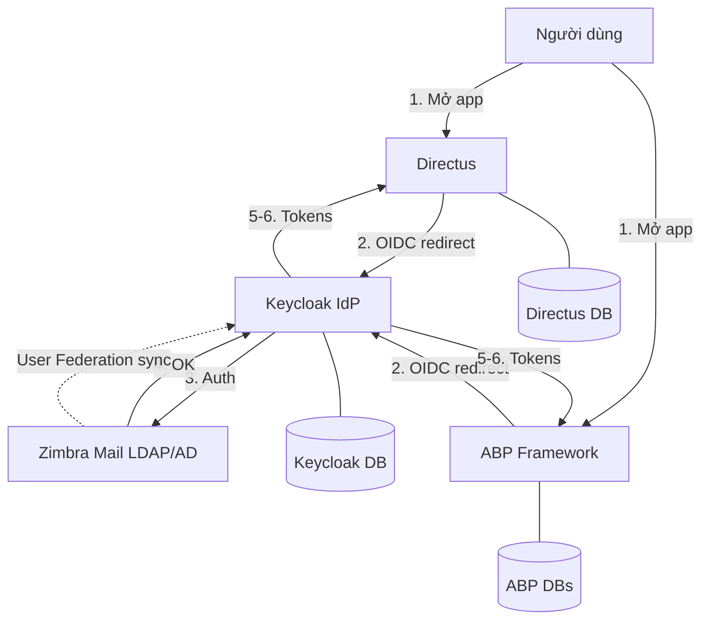

# System Architecture — BD SSO

> Xem chi tiết vận hành local trong [`workspace-architecture.md`](./workspace-architecture.md).  
> Diagram gốc: [`../system-sso-guideline.png`](../system-sso-guideline.png).

---

## Component diagram

---

## Responsibility split

| Layer | Responsibility |
|-------|----------------|
| Zimbra | Credential source; LDAP groups/departments |
| Keycloak | Authenticate, federate users, issue OIDC tokens, central roles |
| Directus | App authz (collections/policies) after token validation |
| ABP | App authz (permissions, orgs, workflows) after token validation |

---

## Local runtime map

| Process | Typical entry | Notes |
|---------|---------------|-------|
| Keycloak | `docker compose` in `directus-main` | `:5110` |
| Directus | Node/pnpm per upstream | OIDC → Keycloak |
| ABP infra | `abp-blazor/etc/docker` | Redis, DBs, etc. |
| ABP apps | `dotnet run` / ABP Studio | AuthServer + Blazor + services |

---

## Trust boundary

- Browser redirects only to Keycloak for credentials (apps không nhận password Zimbra trực tiếp trong mô hình chuẩn).  
- Apps trust JWTs/OIDC assertions từ Keycloak realm.  
- App DBs không thay thế Keycloak DB cho identity trung tâm.  
