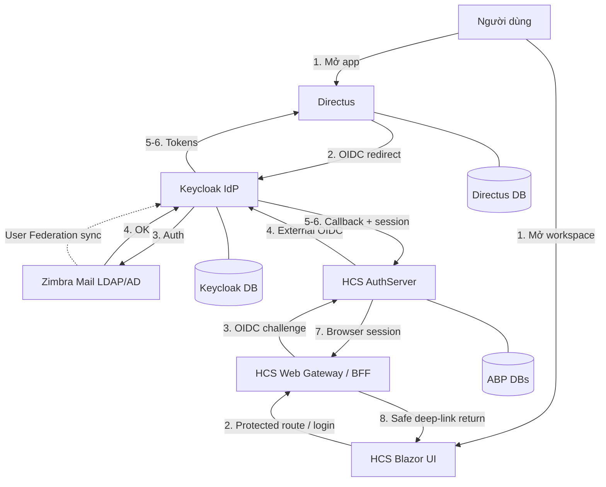
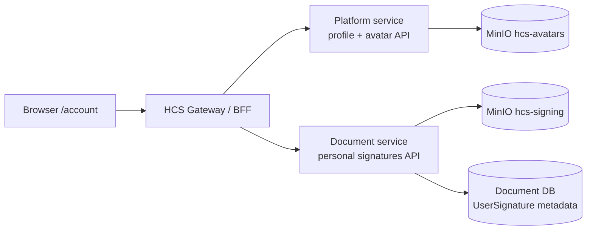

# System Architecture — BD SSO

> Xem chi tiết vận hành local trong [`workspace-architecture.md`](./workspace-architecture.md).  
> Diagram gốc: [`../system-sso-guideline.png`](../system-sso-guideline.png).

---

## Component diagram

### HCS account and signing flow

- `/account` is the single profile entry point. The `profile` and `signatures` query tabs are UI deep links, not separate authorization scopes.
- Avatar and signature content are image-only and capped at 2 MB. Signature self-service resolves the current authenticated user; managing another user remains restricted by the existing elevated policy.
- `FileName`, `Type` (`Electronic`/`Digital`) and `IsDefault` are persisted in `UserSignature` metadata. The Document service enforces one default per user and selects the newest remaining signature when the default is deleted. Existing rows receive `Electronic` as the migration default.

---

## Responsibility split

| Layer | Responsibility |
|-------|----------------|
| Zimbra | Credential source; LDAP groups/departments |
| Keycloak | Authenticate, federate users, issue OIDC tokens, central roles |
| Directus | App authz (collections/policies) after token validation |
| HCS Blazor UI | Protect routes, render workspace and redirect unauthenticated visitors to the BFF |
| HCS Web Gateway / BFF | Own browser session, validate return origins, proxy protected API/hub requests |
| HCS AuthServer | OIDC client of Keycloak and authority used by the BFF |
| HCS Platform service | Profile updates and authenticated avatar upload/read/delete; avatar binaries in MinIO |
| HCS Document service | Personal signature list/upload/rename/replace/default/delete/preview; metadata in Document DB and binaries in MinIO |

---

## Local runtime map

| Process | Typical entry | Notes |
|---------|---------------|-------|
| Keycloak | `docker compose` in `directus-main` | `:5110` |
| Directus | Node/pnpm per upstream | OIDC → Keycloak |
| HCS Community | `services/HCS_web_free_license/docker-compose.yml` | Default Docker Compose runtime; browser at `https://hcs.localhost` |
| HCS gateway | `/bff/login` | Starts sign-in; only configured UI origins may be used as deep-link returns |

---

## Trust boundary

- Browser credentials are handled by Keycloak through the AuthServer; the Blazor client does not receive tokens.
- The BFF session cookie is secure and HTTP-only; protected API and SignalR requests go through the gateway.
- Apps trust JWTs/OIDC assertions từ Keycloak realm.  
- App DBs không thay thế Keycloak DB cho identity trung tâm.  
