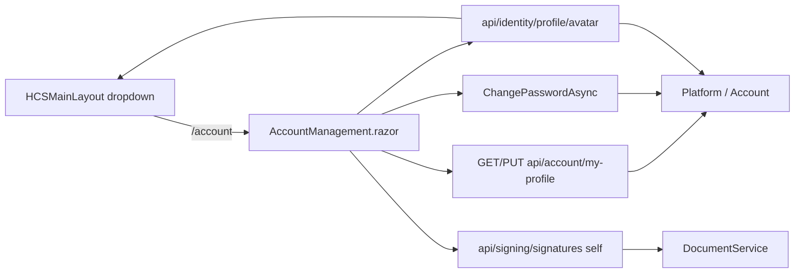

# HCS in-app account management

## Overview

Chuyển “Quản lý tài khoản” từ AuthServer (`auth.hcs…/Account/Manage`) sang page Blazor Client nội bộ. Topbar bỏ “Không gian làm việc”. Page mới cho mọi user đã login: họ tên, tên đăng nhập, SĐT, email, đổi mật khẩu, upload avatar (hiện trên topbar), cấu hình chữ ký cá nhân (self-service không cần `Documents.Signing.Execute`).

## Decisions (đã chốt)

| Quyết định | Chọn |
|---|---|
| Avatar | API đầy đủ + hiển thị topbar (thay initials khi có ảnh) |
| Chữ ký | Mọi user đã login quản lý chữ ký **của chính mình**; admin/elevated vẫn quản lý hộ |
| Lưu ảnh | **MinIO only** — DB chỉ metadata (`BlobName`, …); cấm bytea / DB blob cho binary ảnh |

## Scope challenge

- Reuse: `IProfileAppService` / `api/account/my-profile`, `UserSignaturesPanel` + Document signing APIs, layout dropdown trong `HCSMainLayout.razor`.
- Minimum set: sửa dropdown → page `/account` → profile/password UI → avatar Platform API → nới auth chữ ký self → wire topbar img.
- Không làm: AuthServer Manage redesign, Pro ProfilePicture, đổi mật khẩu IdP/Keycloak/Zimbra, credentials HSM/CA trên page này.

## Architecture



## Phases

| Phase | Name | Status |
|---|---|---|
| 1 | [Topbar + account shell](phase-01-topbar-account-shell.md) | completed |
| 2 | [Profile + password](phase-02-profile-password.md) | completed |
| 3 | [Avatar API + topbar](phase-03-avatar-api-topbar.md) | completed |
| 4 | [Signature self-service](phase-04-signature-self-service.md) | completed |
| 5 | [Polish + verify](phase-05-polish-verify.md) | completed |

## Dependencies

- Soft-provides avatar URL cho [document parity phase-02](../260821-1634-hcs-document-workflow-signing-ui-parity/phase-02-user-select2.md) (`GET /api/identity/users/{id}/avatar`); plan đó có thể dùng initials tạm.
- YARP `/api/identity/**` → Platform và `/api/signing/**` → Document đã có; không cần route mới nếu giữ prefix này.
- **Tất cả ảnh (avatar + chữ ký) lưu MinIO** — DB chỉ giữ metadata (`BlobName`, content-type, size). Không bytea / AbpBlobs DB cho binary ảnh.
- Avatar: Platform + container MinIO `hcs-avatars` (mirror pattern Document `hcs-signing`); chữ ký giữ Document `hcs-signing`.

## Non-goals

- Không mở lại AuthServer `/Account/Manage` từ topbar.
- Không đổi permission của ký văn bản / attempt (`Documents.Signing.Execute` vẫn bắt buộc khi ký document).
- Không sync password lên Keycloak/Zimbra trong scope này (UI hiện warning khi `IsExternal` / `!HasPassword`).
- Không lưu binary ảnh (avatar/chữ ký) trong PostgreSQL / AbpBlobs database provider.

## Success criteria

1. Dropdown user không còn “Không gian làm việc”; “Quản lý tài khoản” mở `/account` same-tab (không `auth.hcs`).
2. User chỉ cần đăng nhập để vào `/account` và sửa profile/password (local), avatar, chữ ký của mình.
3. Topbar hiện ảnh avatar khi đã upload; fallback initials khi chưa có / lỗi tải.
4. User không có `Documents.Signing.Execute` vẫn CRUD được chữ ký self; quản lý chữ ký user khác vẫn elevated.

## Risks

- External IdP users: đổi mật khẩu ABP local có thể không đổi mật khẩu đăng nhập thật → bắt buộc message rõ trên UI.
- Avatar MinIO: cần wire `AbpBlobStoring.Minio` + `Minio:*` config trên Platform (cùng cluster MinIO lab với Document).
- Limit 2MB + content-type `image/*`; rollback blob nếu SaveChanges metadata fail (giống UserSignature).
- Cache avatar trên topbar/BFF: URL same-origin BFF + cache-bust query sau upload; không expose MinIO public URL.

## Cook

```text
/ck:cook --auto /Users/nguyenlong/Documents/Projects/bd-workspace/plans/260821-1652-hcs-account-management/plan.md
```
