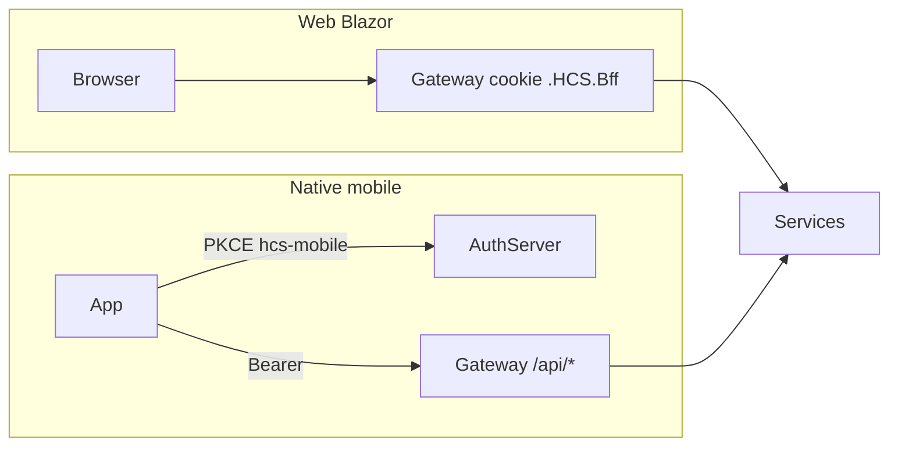

# HCS Mobile API — theo page Web

Tài liệu này mô tả **đúng các API mà trang Web đang gọi**, để native mobile làm parity. Nguồn sự thật: Blazor `*Client.cs` + call-site trong `Pages/*.razor`, không phải Swagger từng microservice.

Cập nhật theo mã nguồn ngày 2026-09-21.

## Cách đọc

1. Đọc [00-auth.md](00-auth.md) trước: đăng nhập PKCE, header, lỗi, phân trang.
2. Mở file module tương ứng màn hình. Mỗi file có bảng **page Web → API**.
3. Lookup dùng chung (phòng ban, danh mục, contacts) nằm ở [11-lookups.md](11-lookups.md); các module khác chỉ cross-link.

Base URL mobile = **Gateway**. Không gọi port nội bộ `44411`–`44415`.

| Môi trường | Auth Server | Gateway / API |
|---|---|---|
| Local | `https://localhost:44401` | `https://localhost:44402` |
| Production | `https://auth-hcs.htltech.vn` | `https://api-hcs.htltech.vn` |

Ví dụ: `GET https://api-hcs.htltech.vn/api/projects`.

## Kiến trúc

Web giữ access token trên Gateway (cookie session). Mobile dùng Authorization Code + PKCE, gọi Gateway bằng `Authorization: Bearer`. Cùng REST `/api/*` và SignalR `/hubs/chat`.

## Phạm vi

Có trong bộ docs này:

- Workspace, tài khoản, văn bản + ký số, quy trình
- Dự án / công việc, lịch, sự kiện, khảo sát
- Chat + thông báo, mạng xã hội
- Lookup mà các page trên đang gọi (OU, master-data GET, contacts, assignees, avatar)

Không có: CRUD admin, danh mục quản trị, audit, service logs, branding, KPI ký số, báo cáo `/reports`.

## Ma trận page → file

| Page Web | Permission | File |
|---|---|---|
| `/account` | Authenticated | [01-account.md](01-account.md); chữ ký → [03-documents.md](03-documents.md) |
| `/workspace` | `WorkManagement.Dashboard` | [02-workspace.md](02-workspace.md) |
| `/manage-documents`, `/my-documents`, `/document-assignments`, `/document-files`, `/document-histories` | `Documents.View` | [03-documents.md](03-documents.md) |
| `/document-detail`, `/document-detail/{id}`, `/view-document-detail/{id}` | `Documents.View` | [03-documents.md](03-documents.md) |
| `/document-signing`, `/signature-settings`, `/user-signatures` | Signing / authenticated | [03-documents.md](03-documents.md) |
| `/workflow-definitions`, `/workflow-lists`, `/workflow-detail` | `Documents.Workflow.View` | [04-workflows.md](04-workflows.md) |
| `/workflow-instances`, `/document-workflow-instances` | `Documents.Workflow.View` | [04-workflows.md](04-workflows.md) |
| `/projects`, `/project-detail/{id}` | `WorkManagement.Projects` | [05-projects-tasks.md](05-projects-tasks.md) |
| `/tasks`, `/project-task-detail/{id}` | `WorkManagement.ProjectTasks` | [05-projects-tasks.md](05-projects-tasks.md) |
| `/calendar-events`, `/calendar-event-detail/{id}` | `WorkManagement.Calendar` | [06-calendar.md](06-calendar.md) |
| `/events`, `/events/{id}`, `/event-dashboard` | `WorkManagement.Events` | [07-events.md](07-events.md) |
| `/event-check-in/{code}` | Public lookup; confirm/check-in cần user đã login | [07-events.md](07-events.md) |
| `/survey-locations`, `/survey-criterias` | `WorkManagement.SurveyManagement` | [08-surveys.md](08-surveys.md) |
| `/survey-sessions`, `/survey-results` | `WorkManagement.Surveys` | [08-surveys.md](08-surveys.md) |
| `/survey-collections/{locationId}` | Anonymous | [08-surveys.md](08-surveys.md) |
| `/chat`, `/chat/{id}`, `/notifications` | `Collaboration.Chat` / `Collaboration.Notifications` | [09-chat.md](09-chat.md) |
| `/social`, `/social/profile`, `/social/profile/{userId}` | `Collaboration.Social` | [10-social.md](10-social.md) |

## Mục lục file

| File | Nội dung |
|---|---|
| [00-auth.md](00-auth.md) | PKCE, header, bootstrap ABP, lỗi, phân trang |
| [01-account.md](01-account.md) | Hồ sơ, mật khẩu, avatar |
| [02-workspace.md](02-workspace.md) | Tổng quan: lịch, dự án, task, hàng đợi ký, thông báo |
| [03-documents.md](03-documents.md) | Văn bản, file, gửi/thu hồi, ký số, chữ ký |
| [04-workflows.md](04-workflows.md) | Loại / định nghĩa / mẫu / hồ sơ / quyết định |
| [05-projects-tasks.md](05-projects-tasks.md) | Dự án, thành viên, công việc, tài liệu gắn task |
| [06-calendar.md](06-calendar.md) | Lịch công tác |
| [07-events.md](07-events.md) | Sự kiện, điểm danh, QR, check-in |
| [08-surveys.md](08-surveys.md) | Khảo sát quản trị + thu thập public |
| [09-chat.md](09-chat.md) | Chat REST, SignalR, thông báo |
| [10-social.md](10-social.md) | Feed, comment, reaction, media; rating trên profile |
| [11-lookups.md](11-lookups.md) | OU, master-data GET, contacts, assignees |

## Lệch so với runbook cũ

Runbook [`docs/runbooks/hcs-mobile-api.md`](../../runbooks/hcs-mobile-api.md) đã chuyển thành stub. Các điểm Web hiện tại khác bản 2026-09-09:

- `/workspace` **không** gọi `GET /api/dashboard`.
- Lookup phòng ban dùng `/api/identity/organization-unit-lookup`, không dùng CRUD `/api/organization/departments`.
- Web còn gọi `DELETE /api/documents/{id}`, `POST /api/documents/{id}/activity`, `GET /api/chat/contacts/lookup`, `PUT /api/surveys/results/{sessionId}/handling`.
