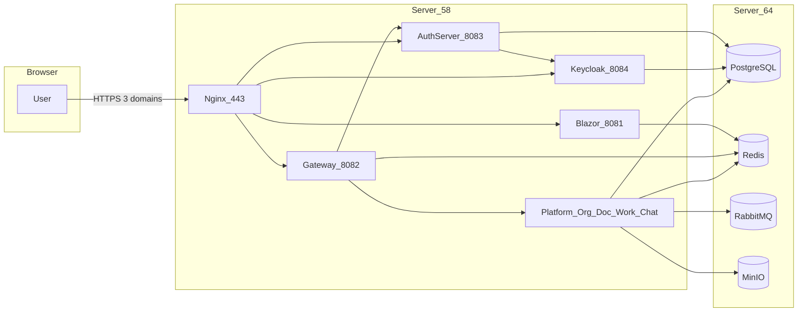

# Deploy HCS Community lên Ubuntu 24 (2 server)

Runtime lab một máy (`docker-compose.yml` + Caddy + `hcs.localhost`) **giữ nguyên**. Tài liệu này là bản production/intranet: data tách server, TLS Let's Encrypt, Nginx thay Caddy.

| Server | IP | Vai trò |
|--------|-----|---------|
| Data | `10.17.227.64` | PostgreSQL 17, Redis 7.4 (có password), RabbitMQ 4.1, MinIO |
| Services | `10.17.227.58` | Nginx, Keycloak, 8 host HCS, DbMigrator |

File cấu hình: [`deploy/ubuntu/`](../../deploy/ubuntu/).

## 1. Domain, DNS, mạng

**3 A record** (hoặc split-horizon DNS nội bộ) trỏ **cả ba** về `10.17.227.58`:

| Host | Dùng cho |
|------|----------|
| `hcs.binhduong.vn` | Blazor UI + BFF/Gateway (cùng host — không cần `Bff__CookieDomain`) |
| `auth.hcs.binhduong.vn` | OpenIddict AuthServer |
| `sso.binhduong.vn` | Keycloak |

Wildcard `*.binhduong.vn` **không** cover `auth.hcs.binhduong.vn`. Dùng **một chứng chỉ Let's Encrypt với 3 SAN**.

Đổi tên domain: sửa `.env` (`HCS_PUBLIC_HOST`, `HCS_AUTH_PUBLIC_HOST`, `HCS_SSO_PUBLIC_HOST`) **và** `server_name` / đường dẫn cert trong [`nginx/hcs.conf`](../../deploy/ubuntu/nginx/hcs.conf).

### Ba mạng logic

1. **User / intranet** — trình duyệt → `10.17.227.58:443` (cổng 80 chỉ redirect HTTPS).
2. **App overlay** — Docker bridge trên 58. Nginx chạy **trên host**, proxy vào `127.0.0.1:8081-8084`. Container dùng `extra_hosts` trỏ 3 domain về `host-gateway` để JWT discovery `https://auth.hcs.binhduong.vn` đi ra Nginx.
3. **Data backbone** — TCP `58 → 64`: `5432`, `6379`, `5672`, `9000`. Console `15672` / `9001` chỉ từ 58 (hoặc localhost 64).

Postgres/Redis/Rabbit/MinIO **không** public Internet. Cô lập bằng bind IP `10.17.227.64` + UFW.



## 2. Tài nguyên tối thiểu

| Máy | CPU / RAM / đĩa | Ghi chú |
|-----|-----------------|---------|
| 64 Data | 4 vCPU / 8 GB / 100 GB | Volume Postgres + MinIO |
| 58 Apps | 8 vCPU / 16 GB / 40 GB | 8 host .NET + LibreOffice (Document) + Keycloak + build image |

Đồng bộ giờ: `sudo timedatectl set-ntp true` trên cả hai máy (OIDC lệch giờ sẽ reject token).

## 3. Chứng chỉ — 3 loại, không trộn

| Loại | Dùng cho | Cách cấp |
|------|----------|----------|
| TLS Nginx | Browser HTTPS | Let's Encrypt **DNS-01** (IP `10.17.x` không làm được HTTP-01) |
| OpenIddict PFX | Ký token AuthServer | Tạo một lần, mount `/var/run/hcs-certs/openiddict.pfx` |
| Data Protection PFX | Cookie/key ring Gateway + Blazor (cùng Redis) | File **giống nhau** trên Gateway và Blazor |

TLS Let's Encrypt **không** thay hai file PFX.

### 3.1 Let's Encrypt DNS-01

Cài plugin khớp nhà DNS (ví dụ Cloudflare). Cert một lần với 3 SAN; thư mục live thường lấy tên domain đầu tiên (`hcs.binhduong.vn`) — khớp `ssl_certificate` trong Nginx.

```bash
sudo apt-get install -y certbot python3-certbot-dns-cloudflare
sudo certbot certonly --dns-cloudflare \
  --dns-cloudflare-credentials /root/.secrets/cloudflare.ini \
  -d hcs.binhduong.vn -d auth.hcs.binhduong.vn -d sso.binhduong.vn
```

Không có plugin: `--manual --preferred-challenges dns` (không tự renew). RFC2136 / nhà DNS VN: dùng plugin tương ứng.

Renew: `sudo systemctl enable --now certbot.timer` rồi `sudo nginx -s reload` trong deploy hook.

### 3.2 PFX ứng dụng (trên 58)

```bash
sudo mkdir -p /etc/hcs/certs
sudo chmod 750 /etc/hcs/certs

openssl req -x509 -newkey rsa:2048 -sha256 -days 3650 -nodes \
  -keyout /tmp/hcs-oidc.key -out /tmp/hcs-oidc.crt \
  -subj "/CN=hcs-openiddict"
openssl pkcs12 -export -out /etc/hcs/certs/openiddict.pfx \
  -inkey /tmp/hcs-oidc.key -in /tmp/hcs-oidc.crt

openssl req -x509 -newkey rsa:2048 -sha256 -days 3650 -nodes \
  -keyout /tmp/hcs-dp.key -out /tmp/hcs-dp.crt \
  -subj "/CN=hcs-dataprotection"
openssl pkcs12 -export -out /etc/hcs/certs/dataprotection.pfx \
  -inkey /tmp/hcs-dp.key -in /tmp/hcs-dp.crt

sudo chmod 640 /etc/hcs/certs/*.pfx
rm -f /tmp/hcs-oidc.key /tmp/hcs-oidc.crt /tmp/hcs-dp.key /tmp/hcs-dp.crt
```

Ghi password PFX vào `.env` (`HCS_OPENIDDICT_PFX_PASSWORD`, `HCS_DATAPROTECTION_PFX_PASSWORD`). Không commit PFX (đã có trong `.gitignore`).

## 4. Cài Ubuntu 24 — cả hai máy

```bash
sudo apt-get update
sudo apt-get install -y ca-certificates curl gnupg ufw
sudo timedatectl set-ntp true
```

Docker Engine + Compose v2 (repo Docker, không dùng `docker.io` cũ):

```bash
curl -fsSL https://get.docker.com | sudo sh
sudo usermod -aG docker "$USER"
```

Đăng xuất/nhập lại để group `docker` có hiệu lực.

### UFW — 64 (data)

```bash
sudo ufw default deny incoming
sudo ufw default allow outgoing
sudo ufw allow OpenSSH
sudo ufw allow from 10.17.227.58 to any port 5432 proto tcp
sudo ufw allow from 10.17.227.58 to any port 6379 proto tcp
sudo ufw allow from 10.17.227.58 to any port 5672 proto tcp
sudo ufw allow from 10.17.227.58 to any port 9000 proto tcp
sudo ufw allow from 10.17.227.58 to any port 15672 proto tcp
sudo ufw allow from 10.17.227.58 to any port 9001 proto tcp
sudo ufw enable
sudo ufw status verbose
```

### UFW — 58 (apps)

```bash
sudo ufw default deny incoming
sudo ufw default allow outgoing
sudo ufw allow OpenSSH
sudo ufw allow 80/tcp
sudo ufw allow 443/tcp
sudo ufw enable
```

Chỉ 58 thêm: `nginx`, `certbot`, và (khi build image tại chỗ) Node.js 20 + .NET 10 SDK + ABP CLI để `abp install-libs`.

## 5. Secrets

Trên **cả hai** máy:

```bash
sudo mkdir -p /opt/hcs
# copy source HCS_web_free_license vào /opt/hcs/HCS_web_free_license
cd /opt/hcs/HCS_web_free_license
cp deploy/ubuntu/.env.example deploy/ubuntu/.env
chmod 600 deploy/ubuntu/.env
```

Điền mọi giá trị. Hai file `.env` phải **cùng** mật khẩu Postgres/Redis/Rabbit/MinIO. Máy 64 không cần PFX path; máy 58 bắt buộc.

Redis **bắt buộc password** khi tách server (compose local một máy hiện không đặt password).

## 6. Server 64 — data

```bash
cd /opt/hcs/HCS_web_free_license
chmod +x deploy/ubuntu/up-data.sh
./deploy/ubuntu/up-data.sh
docker compose --env-file deploy/ubuntu/.env -f deploy/ubuntu/docker-compose.data.yml ps
```

Khởi tạo lần đầu tạo 6 database: `hcs_identity`, `hcs_organization`, `hcs_document`, `hcs_work`, `hcs_collaboration`, `hcs_keycloak`.

Kiểm tra **từ máy 58** (không phải từ 64 localhost):

```bash
nc -vz 10.17.227.64 5432
nc -vz 10.17.227.64 6379
nc -vz 10.17.227.64 5672
nc -vz 10.17.227.64 9000
```

`pg_hba` yêu cầu SCRAM cho mọi TCP. Cô lập mạng dựa trên bind `10.17.227.64` + UFW vì Docker NAT không giữ IP nguồn `10.17.227.58`.

## 7. Server 58 — apps

Trước lần build sạch (AuthServer cần static ABP libs, không nằm trong Git):

```bash
cd /opt/hcs/HCS_web_free_license
env YARN_IGNORE_ENGINES=1 abp install-libs
chmod +x deploy/ubuntu/up-apps.sh
./deploy/ubuntu/up-apps.sh
```

Script chờ cổng data trên 64, build 9 image, chạy DbMigrator, rồi `up -d`. Publish loopback:

| Cổng host | Container |
|-----------|-----------|
| `127.0.0.1:8081` | Blazor |
| `127.0.0.1:8082` | Web Gateway / BFF |
| `127.0.0.1:8083` | AuthServer |
| `127.0.0.1:8084` | Keycloak |

App nội bộ (Platform, Organization, Document, Work, Collaboration) chỉ nghe trong Docker network.

### Nginx

```bash
sudo apt-get install -y nginx
sudo cp deploy/ubuntu/nginx/hcs-proxy.inc /etc/nginx/hcs-proxy.inc
sudo cp deploy/ubuntu/nginx/hcs.conf /etc/nginx/sites-available/hcs.conf
sudo ln -sfn /etc/nginx/sites-available/hcs.conf /etc/nginx/sites-enabled/hcs.conf
sudo rm -f /etc/nginx/sites-enabled/default
sudo nginx -t
sudo systemctl enable --now nginx
```

Mapping path (copy đúng Caddy lab):

**`hcs.binhduong.vn`**

- `/Account/Login` → 302 `/login`
- `/Account/*` → 302 `https://auth.hcs.binhduong.vn$uri`
- `/bff/`, `/signin-oidc`, `/signout-callback-oidc`, `/api/`, `/hubs/` → Gateway (`/hubs/` WebSocket)
- còn lại → Blazor

**`auth.hcs.binhduong.vn`**: `/` → UI; còn lại → AuthServer

**`sso.binhduong.vn`**: toàn bộ → Keycloak

Bật Nginx **sau** khi 8081–8084 listen. Container resolve HTTPS public host về `host-gateway` nên Nginx phải terminate TLS hợp lệ trước khi login.

## 8. Keycloak (lần đầu)

1. Mở `https://sso.binhduong.vn` — admin = `HCS_KEYCLOAK_ADMIN` / `HCS_KEYCLOAK_ADMIN_PASSWORD`.
2. Tạo realm `bd` (hoặc import từ lab).
3. Client confidential `hcs-free-auth`:
   - Root URL: `https://auth.hcs.binhduong.vn`
   - Valid redirect: `https://auth.hcs.binhduong.vn/signin-oidc`
   - Web origin: `https://auth.hcs.binhduong.vn`
   - Client secret = `HCS_KEYCLOAK_CLIENT_SECRET` trong `.env`
4. Federation LDAP Zimbra là bước sau (lab BD phase 2). Có thể tạo user local để smoke.

Keycloak chạy `start` (không `start-dev`), DB `hcs_keycloak` trên 64, `KC_PROXY_HEADERS=xforwarded`.

## 9. Smoke test

Từ máy có DNS/hosts trỏ 3 domain về 58:

```bash
curl -I https://hcs.binhduong.vn/
curl -I https://hcs.binhduong.vn/bff/login
curl -I https://auth.hcs.binhduong.vn/
curl -I https://sso.binhduong.vn/
```

Trình duyệt (cửa sổ ẩn danh):

1. `https://hcs.binhduong.vn` → redirect BFF → AuthServer → Keycloak.
2. Đăng nhập → cookie BFF HTTP-only trên `hcs.binhduong.vn` → về `/`.
3. Mở `/chat` nếu user có quyền `Collaboration.Chat`.
4. Hard refresh (Ctrl+Shift+R).

Authorize URL phải là `https://auth.hcs.binhduong.vn/connect/authorize`, không phải `http://web-gateway/...`.

## 10. Backup và rollback

**Backup 64** (dừng ghi hoặc dùng snapshot VM nếu có):

```bash
docker compose --env-file deploy/ubuntu/.env -f deploy/ubuntu/docker-compose.data.yml exec -T postgres \
  pg_dumpall -U hcs > /var/backups/hcs-$(date +%F).sql
docker compose --env-file deploy/ubuntu/.env -f deploy/ubuntu/docker-compose.data.yml exec -T redis \
  redis-cli -a "$HCS_REDIS_PASSWORD" --no-auth-warning BGSAVE
```

Volume MinIO/Rabbit: snapshot thư mục Docker volume hoặc backup VM. Migration schema **forward-only** — backup Postgres trước khi chạy lại DbMigrator có thay đổi schema.

**Rollback app 58:** giữ `HCS_IMAGE_TAG` cũ (ví dụ `ubuntu-20260821`), `docker compose ... up -d`. Không `docker compose down -v` trên 64 trừ khi cố ý xoá data.

**Dừng app, giữ volume:**

```bash
docker compose --env-file deploy/ubuntu/.env -f deploy/ubuntu/docker-compose.apps.yml down
docker compose --env-file deploy/ubuntu/.env -f deploy/ubuntu/docker-compose.data.yml down
```

## 11. Sự cố thường gặp

| Triệu chứng | Hướng xử lý |
|-------------|-------------|
| Token/JWT invalid issuer | Container phải resolve `auth.hcs.binhduong.vn` về 58 (`extra_hosts`); Nginx đã up; cert SAN đủ 3 tên |
| Redis connection refused / NOAUTH | Mở 6379 từ 58; `Redis__Configuration` có `password=` |
| Login redirect sai host | So sánh `.env` host với `server_name` Nginx và redirect URI Keycloak |
| AuthServer thiếu CSS | Chưa `abp install-libs` trước `docker compose build` |
| Chat không realtime | Nginx `/hubs/` có `Upgrade`; Collaboration + RabbitMQ + MinIO healthy |
| Let's Encrypt fail | HTTP-01 không dùng được trên IP LAN — phải DNS-01 |
| DbMigrator fail | Postgres chưa sẵn từ 58; sai password; database chưa init (volume cũ không chạy lại `init-databases.sql`) |

Log:

```bash
docker compose --env-file deploy/ubuntu/.env -f deploy/ubuntu/docker-compose.apps.yml logs --tail=200 web-gateway
docker compose --env-file deploy/ubuntu/.env -f deploy/ubuntu/docker-compose.apps.yml logs --tail=200 auth-server
docker compose --env-file deploy/ubuntu/.env -f deploy/ubuntu/docker-compose.apps.yml logs --tail=200 db-migrator
sudo journalctl -u nginx -e
```

## 12. Phạm vi chưa làm trong runbook này

- User Federation LDAP Zimbra
- Kubernetes
- Đổi `docker-compose.yml` lab (Caddy + `hcs.localhost`)
